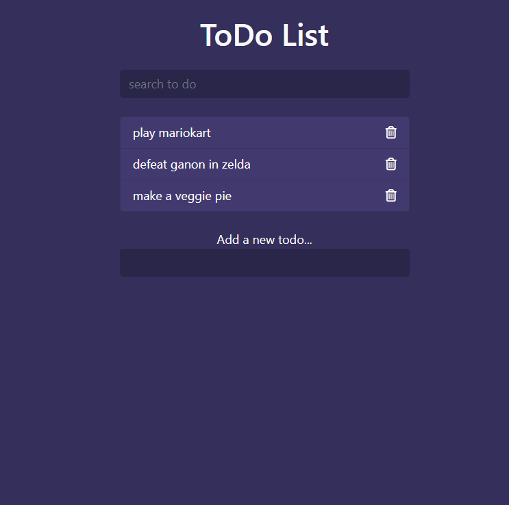
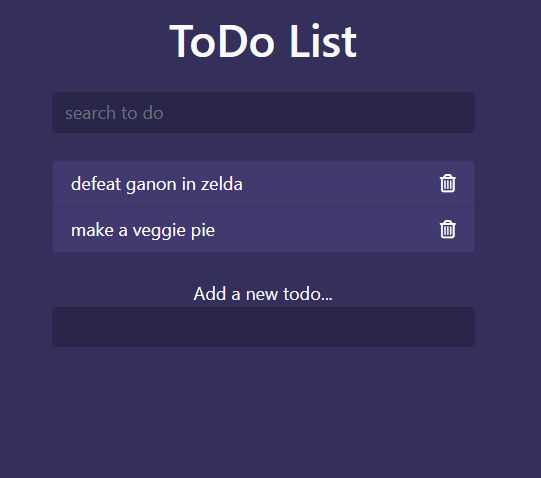
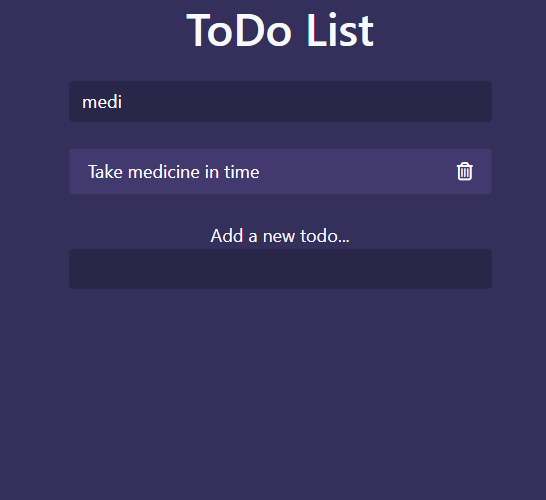
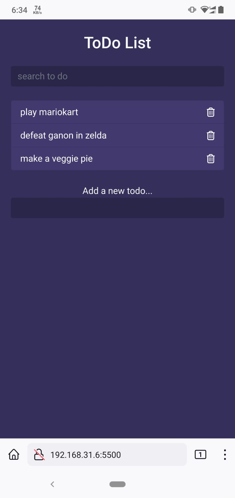

## In this chapter I learned making a to do list 
>This todo app contains the features of 
>adding todo tasks
>delete them 
>and search them

### Adding new tasks
```js
  const addForm = document.querySelector('.add');

  const ehaUl = document.querySelector('.todos');

  const search = document.querySelector('.search input');
```

```js

addForm.addEventListener('submit',e=>{
    e.preventDefault();
    const toDO = addForm.add.value.trim();
    if (toDO.length) {
        generateTemplate(toDO);
        addForm.reset();
    }
});

const generateTemplate = toDO=>{
    // console.log(toDO);
    const template=`
    <li class="list-group-item d-flex justify-content-between align-items-center">
    <span>${toDO}</span>
    <i class="far fa-trash-alt delete"></i>
    </li>
    `;
    ehaUl.innerHTML+=template;
}

```
### delete todos
``` js
// delete todos
ehaUl.addEventListener('click',e=>{
    if (e.target.classList.contains('delete')) {
        e.target.parentElement.remove();
    }
});

```

### Searching todos
```js
// keyup event 
search.addEventListener('keyup',(e)=>{
    const term = search.value.trim().toLowerCase();
    fileterTodos(term);
    //console.log(term);
})
```

### This one is complicated

```js
const fileterTodos= term =>{
    Array.from(ehaUl.children)
    .filter(todo=>!todo.textContent.includes(term))
    .forEach(todo=>todo.classList.add('filtered'));

    Array.from(ehaUl.children)
    .filter(todo=>todo.textContent.includes(term))
    .forEach(todo=>todo.classList.remove('filtered'));
};

```
>Main View



>Deleting Task



>Searching task



> Mobile View

